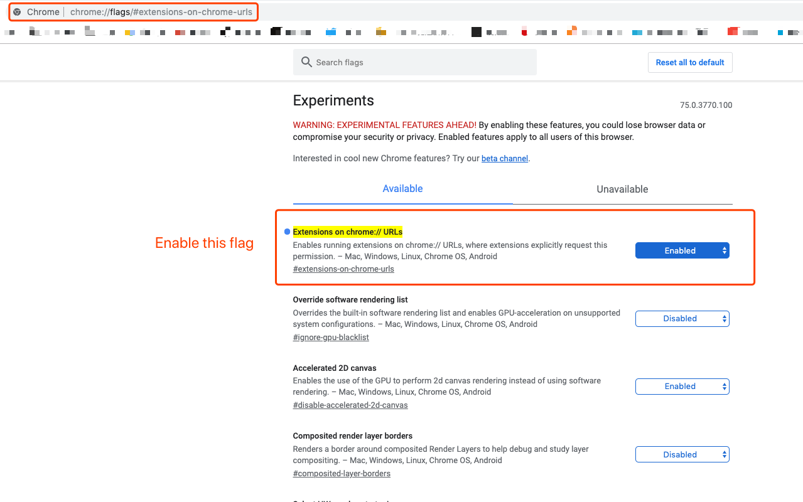

# Flush DNS Chrome Extension

## Introduction

A simple chrome extension help you flush DNS with just one click

## How it works

1. Open a new tab on [chrome://net-internals](chrome://net-internals/#dns) in chrome
2. Invoke chrome interal APIs which exposed to the global environment as if you click those buttons on these pages
3. Send notification if succeed and close the tab quickly

## Setup

You must first open `extensions-on-chrome-urls` flag on [chrome://flags/#extensions-on-chrome-urls](chrome://flags/#extensions-on-chrome-urls)

## License

[MIT](https://opensource.org/licenses/MIT)

Copyright (c) 2019-present, Mactavish
